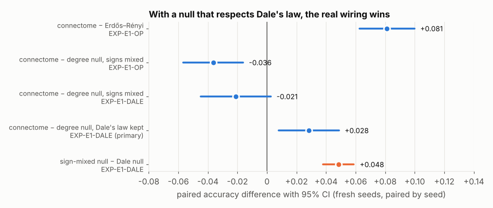
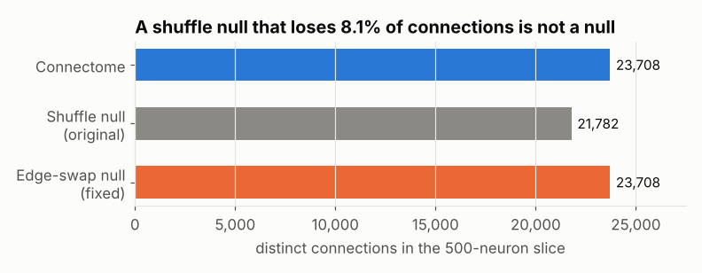

# Fly Lab

**Does a real brain's wiring compute better than random wiring? An auditable test on the
fruit-fly connectome (165,122 neurons, 25.6 M connections) — and the bugs in my own controls
that kept changing the answer.**

[](https://github.com/coder058/fly-brain/actions/workflows/ci.yml)
· Python 3.12/3.13 · CPU-only · MIT (code) / CC-BY 4.0 (data)



## In 60 seconds

- I turned the Janelia **MaleCNS v1.0** connectome into a spiking recurrent network and
  asked whether its wiring beats random graphs on a temporal classification task.
- My first result (connectome ≈ random ≈ 0.76) was **fake**: the readout was peeking at the
  stimulus, the network was silent, and the "random" control silently deleted 8% of the
  brain. I fixed all of it, and the honest answer became a **negative**.
- Three weeks later I audited the negative the same way and found **two more bugs, both biased
  against the connectome**: one gain setting reused across inputs it did not fit (seed 9 ran
  at 1% of target activity), and a 48-neuron readout that missed the few hub neurons
  carrying the signal (seed 5: 20,231 spikes, 18 seen).
- I **preregistered** the fix, pushed it, then ran it on 24 unseen seeds. The connectome now
  clearly beat a random graph — but still *lost* to a degree-preserving rewiring of itself.
- Then I audited the null. Its docstring said weights stay with the sending neuron; they
  didn't. **479 of 500 neurons** in the "control" sent both excitatory and inhibitory
  signals, which no real neuron does (Dale's law). A second preregistered run settled it:
  breaking Dale's law alone gave the null **+0.048 accuracy on 24/24 seeds**, and against a
  null that respects it the **connectome wins, +0.028 [95% CI +0.008, +0.049]**.

> **Status, 8 Oct 2026:** a preregistered replication on 500 *different* neurons
> ([EXP-E1-REPL](reports/EXP_E1_REPL.md)) was `INSTRUMENT_INCOMPLETE` — 11 of 24 seeds failed
> rate matching, and the 13 valid ones leaned the other way. A final preregistered run with
> a fixed matcher on both slices ([EXP-E1-MATCH](experiments/results/EXP-E1-MATCH/protocol.md))
> is in progress. Until it lands, treat the +0.028 as specific to one slice.

The effect is modest and the scope is narrow (below). The point of the project is the
method: every answer above came from a control I had trusted and then checked.

Full story: **[docs/CASE_STUDY.md](docs/CASE_STUDY.md)**.

## Why I built this

Connectomes are now complete enough to download as graphs, and "brain-inspired
architecture" is an easy claim to make and a hard one to test. I wanted to find out what it
actually takes to answer *"is this structure useful?"* without fooling myself — because in
ML and science alike, the expensive mistakes are the convincing results that come from
the measuring instrument rather than the thing being measured. This project is my practice
ground for that: real data at scale, strong null models, positive controls, preregistration,
and the willingness to publish an answer I did not want.

## Try it (no 1 GB download needed)

```bash
git clone https://github.com/coder058/fly-brain && cd fly-brain
pip install -r requirements.txt matplotlib
python -m flylab.demo           # ~30 s: reproduces all four bugs on real connectome data, writes figures/
python -m pytest -q             # 90+ tests
```

The demo runs on [`data/e1_slice/`](data/e1_slice), the exact 500-neuron slice every
experiment used (70 KB, SHA-256 checked, tested equal to the extraction from the full graph).

Reproduce the preregistered experiments (≈ 20 min each on 4 cores; a fresh clone reproduced
all 3,960 EXP-E1-OP result rows exactly):

```bash
python experiments/harness/e1_operating_point.py --seeds 1000:1024 --label confirmatory
python experiments/harness/e1_operating_point.py --seeds 2000:2024 --matchings per_seed --dale --label dale-confirmatory
```

Rebuild everything from Janelia's raw files (≈ 5 min, 16 GB RAM):

```bash
python scripts/download_malecns.py                       # 1.1 GB, SHA-256 verified
python scripts/build_graph.py --out-dir data/derived/graph_check
# -> 165,122 neurons, 25,563,197 connections, 124,025,046 synapses (matches the record exactly)
```

## What the bugs looked like

| | |
|---|---|
|  | **The null that wasn't.** Shuffling connection endpoints and rebuilding a sparse matrix lets SciPy merge duplicates: 8% of connections vanish. Replaced by a directed double-edge swap that preserves every degree exactly ([`flylab/nulls.py`](flylab/nulls.py)). |
|  | **One gain for every input.** Each seed drives a different 10% of neurons. A random graph doesn't care; the hub-heavy connectome swings from 0.1× to 3.3× the target activity. Fixed by matching activity per seed. |
|  | **A readout looking the wrong way.** At equal firing rate the connectome's activity runs through a handful of hubs; about 37 of 450 neurons carry it (a random graph: ~100), and 48 random probes see ~4 of them. Fixed by reading every non-input neuron. |
| *(figure at the top)* | **A control that broke Dale's law.** The degree null's weights followed the receiving neuron, not the sender, so 479 of 500 neurons ended up both exciting and inhibiting. Same edges with weights kept on the sender: the null loses its 5-point edge. ([`flylab/nulls.py`](flylab/nulls.py), `weights_follow="pre"`) |

## Results

Two preregistered experiments, 24 fresh seeds each, firing rate matched per seed (±15%),
full non-input readout, 20 draws of every null. Accuracy on a 5-class task (chance 0.20).

| comparison (paired by seed) | difference | 95% CI | experiment |
|---|---|---|---|
| connectome − Erdős–Rényi graph | +0.081 | [+0.063, +0.100] | [EXP-E1-OP](reports/EXP_E1_OP.md) |
| connectome − degree null that mixes output signs | −0.036 | [−0.057, −0.016] | EXP-E1-OP |
| **connectome − degree null that keeps Dale's law** | **+0.028** | **[+0.008, +0.049]** | [**EXP-E1-DALE**](reports/EXP_E1_DALE.md) (primary) |
| sign-mixing null − Dale null (same edges) | +0.048 | [+0.038, +0.059] | EXP-E1-DALE |
| connectome − no network (input only) | +0.051 | [+0.026, +0.075] | EXP-E1-DALE |

How much each instrument fix mattered (EXP-E1-OP, connectome vs the sign-mixing degree null):

| gain matching / readout | connectome | degree null | Erdős–Rényi | connectome − degree null |
|---|---|---|---|---|
| global / 48 probes *(original)* | 0.754 (n=20) | 0.719 | 0.650 | +0.042 [−0.041, +0.126] |
| global / full | 0.877 | 0.892 | 0.785 | −0.015 [−0.037, +0.007] |
| per-seed / 48 probes | 0.712 (n=21) | 0.739 | 0.656 | −0.024 [−0.093, +0.044] |
| per-seed / full | 0.869 | 0.906 | 0.788 | −0.036 [−0.057, −0.016] |

Missing connectome seeds in the 48-probe rows were refused by the liveness guard: each had
11,870–18,306 non-input spikes, of which 6–198 reached the probes.


**What it means.** On this task and slice, the fly's wiring carries a temporal signal better
than a random graph (+8 points) *and* better than a rewiring that keeps every neuron's
degrees, outgoing weights and sign (+2.8 points). The second result only appears once the
control obeys the same biological constraint as the thing it controls for.

**What it does not mean.** It is one task, one simple neuron model and one 500-neuron,
hub-selected slice (0.3% of the CNS; inhibition-dominated; 243 of the 500 neurons have no
confident transmitter prediction, so their outgoing weights are zero). The three
preregistered comparisons form a sequence, each prompted by auditing the previous one —
weigh the sequence, not the last interval alone. Replication on another slice and task is the
next step. Nothing here is a claim about fly intelligence.

## Repository map

| path | what |
|---|---|
| [`flylab/`](flylab) | library: graph loading, LIF dynamics, nulls, spectral gain, the bundled slice, the demo |
| [`experiments/harness/`](experiments/harness) | experiment runners; [`e1_operating_point.py`](experiments/harness/e1_operating_point.py) is the headline |
| [`experiments/results/`](experiments/results) | append-only results, `<prefix>_<UTC>_<git rev>.json`, with protocols |
| [`reports/`](reports) | audits and errata ([`E1_audit_fixes.md`](reports/E1_audit_fixes.md), [`EXP_E1_OP.md`](reports/EXP_E1_OP.md), [`EXP_E1_DALE.md`](reports/EXP_E1_DALE.md)) |
| [`tests/`](tests) | unit tests for nulls, leakage, liveness, determinism, the slice and the 2×2 runner |
| [`RESEARCH_LEDGER.yaml`](RESEARCH_LEDGER.yaml) · [`SCIENTIFIC_CLAIMS.md`](SCIENTIFIC_CLAIMS.md) | every experiment ID and what may be claimed from it |
| [`research/`](research), [`anomaly/`](anomaly) | later exploratory tracks (motif mining, routing, anomaly detection); see the ledger for their status |
| [`docs/lab-notebook/`](docs/lab-notebook) | raw working notes from the experiment loop, kept for transparency |

Other experiments (memory, ignition, glutamate polarity, motif controls) are recorded in the
ledger with their outcomes — mostly instrument failures the harness refused to score. None
is a positive result.

## How this was built

Solo project on a 2-vCPU cloud VM, then a 4-core container; no GPU. AI coding assistants
were used as pair programmers and as adversarial reviewers — several of the bugs above
were found by asking one to audit the code line by line as hostilely as possible. Every
experiment was gated by a written protocol before it ran, and every number in this README
links to a result file in the repository.

## Data and license

Code: MIT. Data: [MaleCNS v1.0](https://male-cns.janelia.org/), Janelia FlyEM, CC-BY 4.0;
the files under `data/` are subsets of it. See [`data/README.md`](data/README.md).
