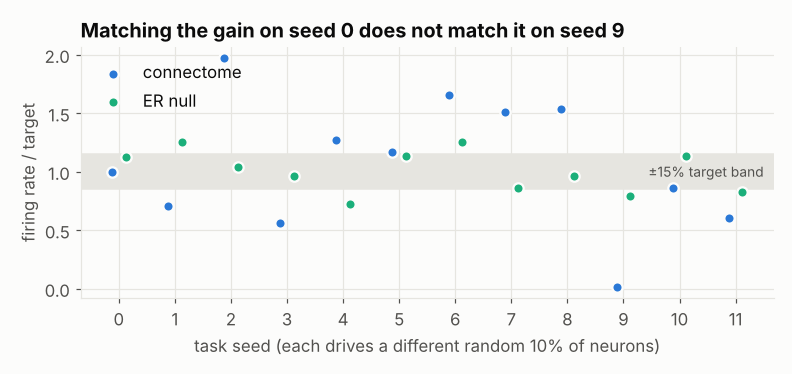
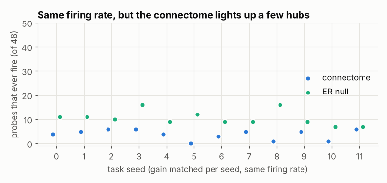
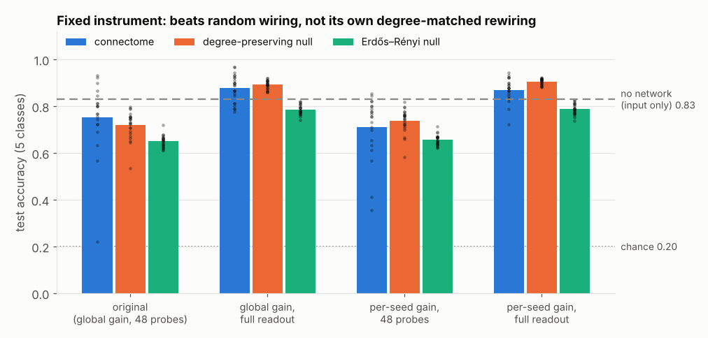
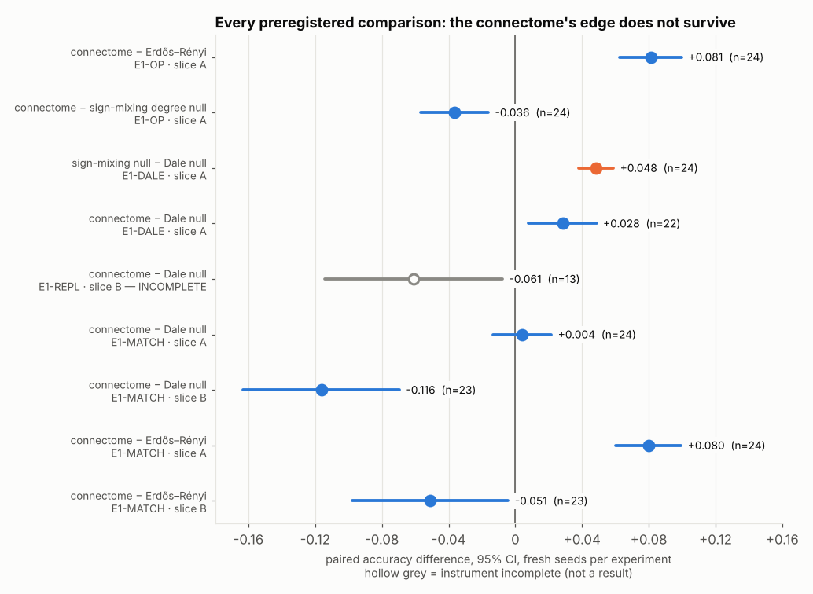

# When the nulls are honest: auditing a fly-brain reservoir computer

*Case study — Fly Lab, September–October 2026*

## The question

The FlyEM team at Janelia has released a complete wiring diagram of an adult male
fruit-fly central nervous system, brain and nerve cord together (MaleCNS v1.0). Keeping
only fully traced neurons gives 165,122 neurons, 25.6 million directed connections and
124 million synapses — an entire nervous system you can download as a graph.

That invites an engineering question that is easy to ask and hard to answer honestly:

> **If you run a real brain's wiring as a recurrent neural network, does its structure
> compute better than random wiring with the same statistics?**

The "random wiring" part is where most of the difficulty lives. A connectome differs from a
random graph in many boring ways — its size, degree distribution, weight scale, sign
balance, how excitable it is — and any one of them can produce a "win" or a "loss" that says
nothing about structure. So the project became, in practice, a project about building an
instrument that cannot fool itself, and then checking whether it had.

## What I built

- **Data pipeline.** Hash-locked download of the three MaleCNS v1.0 files, a streaming
  builder that keeps only traced-to-traced connections and signs each one by the
  presynaptic neuron's predicted transmitter (acetylcholine +, GABA/histamine −, unknown 0).
  On a clean machine it reproduces the recorded totals exactly:
  165,122 neurons, 25,563,197 connections, 124,025,046 synapses.
- **Simulator.** Leaky integrate-and-fire dynamics on sparse signed matrices, CPU only.
- **Task.** Five classes of noisy temporal pulse patterns are injected into a random 10% of
  neurons; a ridge readout on binned spiking of the *other* neurons must name the class.
- **Controls.** A degree-preserving null (directed double-edge swap, exact in- and
  out-degrees — see Round 5 for what it did with the weights), an Erdős–Rényi null with the
  same edge count, a parameter-matched MLP, a no-network baseline, and a positive control
  (ring lattice vs random graph) the instrument must pass before any comparison counts.
- **Discipline.** Preregistered protocols, append-only results named
  `<prefix>_<UTC>_<git rev>.json` with harness and config hashes, liveness gates that
  refuse to score a silent network, and 90+ unit tests for the pieces most likely to lie.

## Round 1: the first number was fake

The first pipeline reported connectome 0.76, ER 0.76, shuffle 0.77, MLP 0.87. An
adversarial line-by-line audit found that none of it measured structure:

| bug | effect |
|---|---|
| Probe neurons included driven inputs | the readout was decoding the stimulus; with the leak removed every arm fell to **exactly chance (0.200)** |
| Default gain left the network silent | 0 useful non-input spikes; the "liveness" guard only checked feature variance, which the leak satisfied |
| "Degree shuffle" rebuilt a sparse matrix from permuted endpoints | SciPy sums duplicate entries: **7.9% of connections silently vanished** and self-loops appeared |
| One hand-tuned gain for every graph | the arms ran at effective gains **49× apart** |
| 5 seeds × 20 trials | the positive control *failed* at these settings: a real +0.15 effect measured as −0.03 ± 0.19 |

Each was fixed and tested ([`reports/E1_audit_fixes.md`](../reports/E1_audit_fixes.md)).
Gain became a controlled variable via spectral normalisation, then arms were matched on
firing rate instead, because equal spectral radius still left 50× activity differences.

## Round 2: an honest negative

With the instrument repaired, a powered run (12 seeds × 60 trials/class × 20 null draws,
rate-matched) gave:

| arm | accuracy |
|---|---|
| connectome | 0.634 ± 0.122 |
| degree-preserving null | 0.685 ± 0.030 |
| Erdős–Rényi null | 0.651 ± 0.017 |

No advantage; intervals cross zero. It was written up as a negative result, and the follow-up
memory and ignition experiments that tried to find a better operating point ended as
`NO_PAIR` / `NO_COIGNITE` — the instrument refused to score them rather than report
something it could not defend.

## Round 3: auditing the audit

In October 2026 I re-read the negative result the way I had read the first fake positive.
Two numbers did not fit: the connectome's interval was **seven times wider** than the
nulls', and its per-seed scores were 0.51–0.82 on ten seeds and **0.21 and 0.20** — chance —
on seeds 5 and 9. Without those two, the connectome and the degree-preserving null were
tied (−0.002); two seeds were carrying the negative mean.

I rebuilt the graph from the raw Janelia files on a fresh machine (identical totals) and
traced each failure.

**Seed 9 — "identical by construction" was not.** The harness matched each graph's gain
once, on seed 0's input pattern, with a comment saying drive statistics are identical across
seeds. But every seed stimulates a *different* random 10% of neurons. For a random graph that
hardly matters. For the connectome, whose activity runs through a few hubs, it is
everything: at one fixed gain its firing rate ranged from **0.01× to 1.97×** the target
across seeds. Seed 9 was effectively silent — 306 spikes against ~15,000 for the nulls —
and the liveness guard passed it because its threshold was one spike.

**Seed 5 — the readout was looking at the wrong neurons.** Features came from 48 fixed
random "probe" neurons. On seed 5 the connectome fired 20,231 non-input spikes and **18**
landed on the probes. At a matched firing rate, the connectome's activity runs through a median
37 of 450 non-input neurons, a random graph's through about 100; 48 random probes catch
about 4 of the former. The stock positive control (ring lattice vs random graph) had only passed with a 450-neuron
readout; the powered comparison ran with 48, which was validated only later and only by a
constructed feature-injection gate.

Both artifacts penalise a structured graph more than a random one, so the negative result
was not evidence about structure. It was also not evidence for it — seeds 0–11 had now been
looked at too closely to test anything on.

**So I preregistered the fix before running it.** [`EXP-E1-OP`](../experiments/results/EXP-E1-OP/protocol.md)
fixes the endpoint, the exclusion rules and 24 never-used seeds, and was pushed to GitHub
(commit `214c7c7`) before any of those seeds were simulated. It measures the full 2×2 —
gain matching {global, per-seed} × readout {48 probes, all non-input neurons} — for the
connectome, 20 degree-preserving and 20 random nulls, and a no-network baseline. The
original measurement is one cell of that grid and is unit-tested to be bit-identical to
the old harness.

## Round 4: a sharper negative

The confirmatory run took 17 minutes with three worker processes. In the preregistered cell (per-seed gain,
full readout), with no seed excluded:

| comparison | difference | 95% CI |
|---|---|---|
| connectome − Erdős–Rényi null | **+0.081** | [+0.063, +0.100] |
| connectome − degree-preserving null | **−0.036** | [−0.057, −0.016] |
| connectome − no network | +0.039 | [+0.016, +0.063] |

Both mechanistic predictions held: under the old global gain the connectome sat inside the
firing-rate band on only 4 of 24 seeds (0.10×–3.32× of target), under per-seed matching on
24 of 24; the 48-probe readout produced refusals on four seeds whose networks were firing
11,870–18,306 spikes, the full readout produced none.

So the rescue failed, and that is the result. Fixing the instrument cut the seed-to-seed
noise on the key comparison about fourfold and made the negative *sharper*, with a more
specific shape than before:

- **Against random wiring, the connectome wins.** It carries the temporal signal better than
  an Erdős–Rényi graph with the same number of edges.
- **Against its own rewiring, it loses.** Shuffle who-connects-to-whom while keeping every
  neuron's in- and out-degree, and accuracy goes *up* by 3.6 points. I wrote that up as
  "everything useful is in the per-neuron statistics, not the wiring". That sentence did not
  survive the next audit.
- **The old readout hid the network.** With 48 probes the connectome scored 0.117 *below* a
  readout of the raw input; with every neuron read it scores 0.039 above.

Re-running seeds 0–11 through the new runner also reproduced the September numbers
**to every digit** — 10 connectome scores and 223 null draws — from a graph rebuilt from raw
files on a different machine. That is what the versioned results and pinned RNG streams were
for. Full tables: [`reports/EXP_E1_OP.md`](../reports/EXP_E1_OP.md).

## Round 5: the control was breaking a law of biology

Writing "the rewiring keeps each neuron's outgoing weights and sign" in the report, I checked
it instead of trusting the docstring that said so. In the double-edge swap (a→b),(c→d) →
(a→d),(c→b), the weight permutation travelled with the *target*. Each neuron kept its incoming
weights, and its outputs inherited other neurons' signs: **479 of 500 neurons in a null draw
sent both excitatory and inhibitory signals.** In the connectome — and in any real nervous
system obeying Dale's law — that number is 0.

That made the "loss" ambiguous: was the real wiring worse, or was the control cheating? I
added a `weights_follow="pre"` mode that keeps each neuron's outgoing weights (so its sign
and out-strength), left the old behaviour as the default so every earlier result still
reproduces, and **preregistered** [EXP-E1-DALE](../experiments/results/EXP-E1-DALE/protocol.md)
on 24 new seeds. The Dale null uses the *same* random swaps as the legacy one: identical
edges, only the weight assignment differs.

| comparison | difference | 95% CI | seeds |
|---|---|---|---|
| legacy (sign-mixing) null − Dale null | **+0.048** | [+0.038, +0.059] | 24/24 in favour |
| **connectome − Dale null** *(primary)* | **+0.028** | **[+0.008, +0.049]** | 15/22 in favour |
| connectome − legacy null (replication) | −0.021 | [−0.045, +0.002] | |
| connectome − Erdős–Rényi | +0.101 | [+0.080, +0.123] | |

Mixing output signs alone was worth five points to the control, on every seed — enough to
flip the sign of the comparison. Against a control that obeys the same constraint as the
brain, the real wiring won by 2.8 points.

That was the result I had wanted from the start. Its own report said it needed replication
on other neurons before it meant anything. So that is what I did next.

## Round 6: the replication that couldn't measure

I extracted a second, disjoint slice — neurons ranked 501–1000 by out-degree — checked
(accuracy-blind, rates only) that every arm could be driven to the target firing rate, and
preregistered the identical comparison on 24 new seeds
([EXP-E1-REPL](../reports/EXP_E1_REPL.md)).

It came back `INSTRUMENT_INCOMPLETE`: only 13 of 24 connectome seeds landed in the firing-rate
band. The matcher tuned gain on 20 sample trials and stopped at ±15%; on slice B the
connectome's activity varies so much from trial to trial that its full-set rate then landed
anywhere from 0.7× to 4.4× of target. The nulls were fine (458–460 of 480 in band). Another bug
of the same shape: an instrument limitation that hurts the heterogeneous graph more.

The 13 valid seeds pointed the other way (−0.061). The protocol said not to read that as a
result, so I didn't.

## Round 7: the last run

I fixed the matcher — tune on all 210 training trials, stop at ±5%; test trials never used —
and checked, again on rates only, that it put the connectome in band on both slices. Then I
preregistered [EXP-E1-MATCH](../experiments/results/EXP-E1-MATCH/protocol.md) on 48 fresh
seeds across both slices, with a headline rule fixed in advance and a sentence I wrote before
seeing anything: *this is the last comparison in the E1 lineage, and the README reports it as
the current answer.*

| slice | connectome − Dale null | connectome − Erdős–Rényi | valid seeds |
|---|---|---|---|
| A (top 500) | **+0.004 [−0.014, +0.022]** | +0.080 [+0.060, +0.099] | 24/24 |
| B (ranks 501–1000) | **−0.116 [−0.163, −0.069]** | −0.051 [−0.098, −0.004] | 23/24 |

Headline by the preregistered rule: **not supported.** On slice A the +0.028 shrank to
nothing under the tighter matcher (the looser one had let the connectome run about 5% hotter
than its control — a plausible, unproven contributor). On slice B the connectome loses to its
rewiring, to a random graph, and to no network at all. Its lead over random graphs, which
had replicated three times on slice A, is a property of those 500 neurons, not of fly wiring.

Full report: [`reports/EXP_E1_MATCH.md`](../reports/EXP_E1_MATCH.md).

## What I would tell a reviewer

- **The interesting skill here is not the simulator.** It is noticing that a result is too
  convenient — in either direction — and having the tooling to find out why in an afternoon:
  pinned data, versioned results, slices small enough to ship in the repo, and tests that pin
  the old behaviour so the new one can be compared against it.
- **Audit the result you like hardest.** Round 2's negative had two artifacts biased against
  the hypothesis; Round 5's positive did not survive a tighter matcher that removed a few
  percent of extra connectome activity. Both looked like the honest answer when they arrived.
- **Read the code, not the docstring.** The null's comment said the opposite of what it did,
  and every test checked degrees, none checked signs. The new test checks both conventions.
- **Replicate on different data, not just different seeds.** Every slice-A result replicated
  across fresh seeds. None of the interesting ones survived slice B.
- **Preregistration is cheap, and it has to include when to stop.** A Markdown file and a
  commit timestamp turned each post-hoc fix into a test that could fail — and the last one
  said in advance that it was the last one.

## Limits, stated plainly

- One task, one neuron model, two hub-selected 500-neuron slices (0.3% of the CNS each).
  Slice A is mostly optic-lobe and central-brain interneurons; 243 of its 500 neurons have no
  confidently predicted transmitter, so their outgoing weights are zero, 188 are inhibitory and
  69 excitatory.
- Synapse count is used as weight; real synaptic strength, dynamics, gap junctions and
  neuromodulation are absent.
- The task is easy: a readout of the raw input with no network at all scores 0.83. The
  comparison is between graphs as signal *carriers*, not as memories or computers.
- A negative here is about this probe. It does not show connectome wiring is useless — a task
  that needs recurrent memory, or slices chosen by anatomy rather than degree, could differ.
- Nothing here says anything about fly intelligence or biological computation.

## Repo pointers

| | |
|---|---|
| one-command tour on real data | `python -m flylab.demo` |
| preregistered 2×2 | [`experiments/results/EXP-E1-OP/protocol.md`](../experiments/results/EXP-E1-OP/protocol.md) |
| follow-ups | [`EXP_E1_DALE.md`](../reports/EXP_E1_DALE.md) · [`EXP_E1_REPL.md`](../reports/EXP_E1_REPL.md) · [`EXP_E1_MATCH.md`](../reports/EXP_E1_MATCH.md) |
| runner for both | [`experiments/harness/e1_operating_point.py`](../experiments/harness/e1_operating_point.py) |
| nulls (and the bug history) | [`flylab/nulls.py`](../flylab/nulls.py) |
| first audit | [`reports/E1_audit_fixes.md`](../reports/E1_audit_fixes.md) |
| full experiment ledger | [`RESEARCH_LEDGER.yaml`](../RESEARCH_LEDGER.yaml) |
